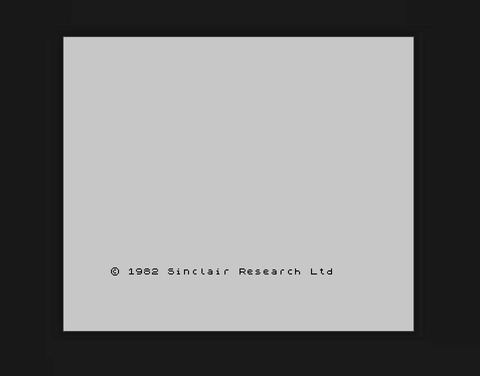
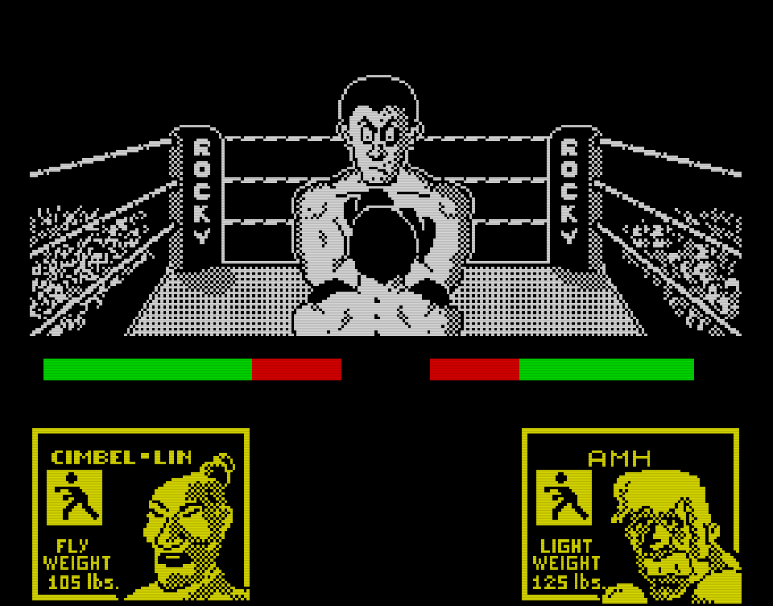
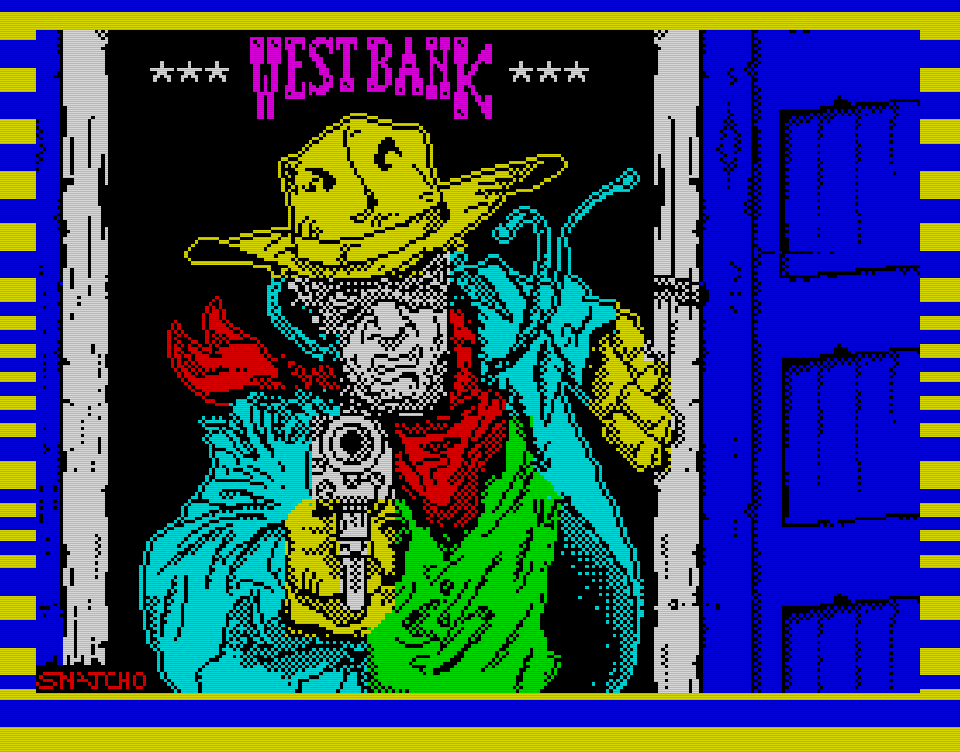
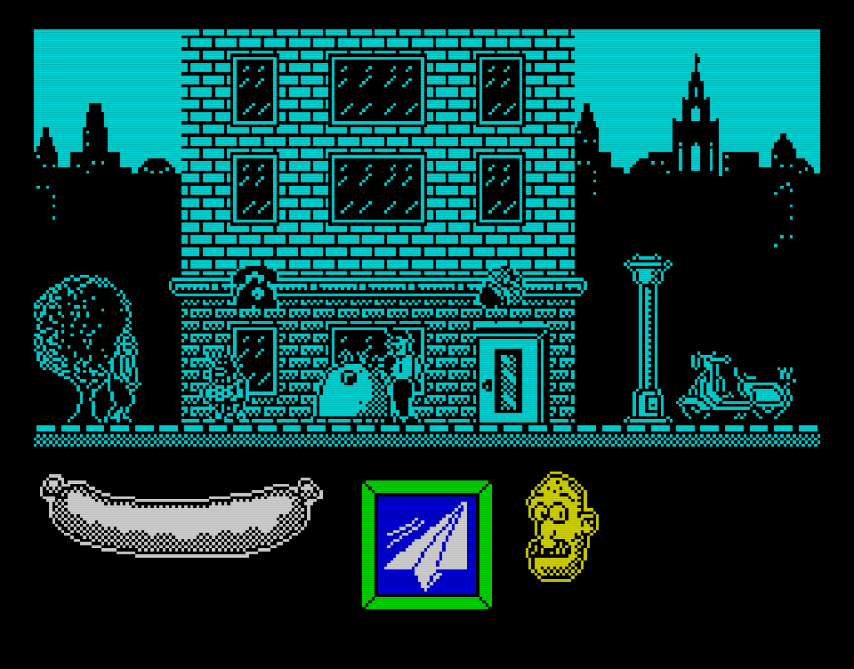

# ZX Generation

A high-fidelity **ZX Spectrum 48K emulator** written entirely in JavaScript, featuring cycle-accurate Z80 CPU emulation, authentic ULA video/audio rendering, and comprehensive tape loading support.

> **🤖 Built 100% with Claude Sonnet 4.5** - This entire codebase was written by AI through prompt-driven development in just one day, as a demonstration of Claude Sonnet 4.5's advanced reasoning and coding capabilities. From the Z80 CPU core to the tape loading system—every single line of code was generated through natural language instructions. This project showcases how far AI-assisted development has evolved.


## 📸 Screenshots

<p align="center">
  
  
</p>

<p align="center">
  
  
</p>

## 🎮 Live Demo

**Try it now:** [https://hi-score.dev](https://hi-score.dev)

> Note: The live demo currently runs an earlier version but demonstrates the same core functionality.

## 🎮 Features

### Core Emulation
- **Complete Z80 CPU Implementation**
  - All documented opcodes including ED, DD, FD prefixes
  - Cycle-accurate instruction timing (T-states)
  - Full interrupt handling (IM 0/1/2)
  - Accurate flag computation for all instructions

- **Authentic ULA Emulation**
  - Pixel-perfect display rendering (256×192, 8 colors + intensity)
  - Contended memory timing
  - Border rendering
  - Flash attribute support

- **Audio System**
  - 1-bit beeper emulation
  - Web Audio API integration
  - Audio Worklet support for low-latency playback

### Tape & File Support
- **TAP Format** - Standard tape files
- **TZX Format** - Advanced tape format with:
  - Standard speed blocks (0x10)
  - Turbo loading blocks (0x11)
  - Pure tone/data blocks
  - Loop structures
  - Pause blocks
- **Z80 Snapshots** - Save state loading
- **Turbo Loading** - 10x+ speed acceleration for fast tape loading

### User Interface
- **Responsive Canvas Rendering** with automatic scaling
- **Full Keyboard Mapping** - PC keyboard to Spectrum keys
- **Touch Keyboard** - Auto-detect mobile devices
- **Drag & Drop** - Load files by dropping onto the emulator
- **Fullscreen Support**
- **Debug Mode** - Instruction trace analyzer

## 🚀 Quick Start

### Installation

```bash
npm install zx-generation
```

### Basic Usage

```html
<!DOCTYPE html>
<html>
<head>
    <title>ZX Spectrum Emulator</title>
</head>
<body>
    <canvas id="screen"></canvas>

    <script type="module">
        import { ZXSpectrum } from 'zx-generation';

        const canvas = document.getElementById('screen');
        const spectrum = new ZXSpectrum(canvas, {
            rom: 'path/to/48k.rom',
            autoStart: true
        });
    </script>
</body>
</html>
```

### Loading Tapes

```javascript
// Load TAP or TZX file
const response = await fetch('game.tap');
const arrayBuffer = await response.arrayBuffer();

spectrum.loadTape(arrayBuffer);
spectrum.playTape();

// Auto-type LOAD ""
await spectrum.typeKeyword('LOAD', 150);
await spectrum.typeText('""', { delay: 250, enterAtEnd: true });
```

### Loading Snapshots

```javascript
// Load Z80 snapshot
const response = await fetch('game.z80');
const arrayBuffer = await response.arrayBuffer();

spectrum.loadSnapshot(arrayBuffer);
```

## 📚 API Reference

### Constructor Options

```javascript
new ZXSpectrum(canvas, {
    rom: 'path/to/48k.rom',           // ROM file URL or ArrayBuffer
    autoStart: true,                   // Auto-start emulation
    sound: true,                       // Enable audio
    useAudioWorklet: true,            // Use Audio Worklet (low latency)
    scale: 'auto',                    // Display scale: 'auto', 1, 2, 3, 4
    handleKeyboard: true,             // Enable keyboard handling
    touchKeyboard: 'auto',            // Touch keyboard: 'auto', true, false
    fps: 50,                          // Target frame rate
    onReady: () => {},                // Ready callback
    onError: (error) => {}            // Error callback
})
```

### Methods

#### Emulation Control
- `start()` - Start emulation
- `stop()` - Stop emulation
- `reset()` - Reset to initial state
- `setTapeTurbo(enabled, multiplier = 10)` - Enable/disable turbo loading

#### Tape Operations
- `loadTape(arrayBuffer)` - Load TAP/TZX file
- `playTape()` - Start tape playback
- `stopTape()` - Stop tape playback
- `getTapeStatus()` - Get tape status object

#### Snapshot Operations
- `loadSnapshot(arrayBuffer)` - Load Z80 snapshot
- `saveSnapshot()` - Save current state to Z80 snapshot

#### Input
- `typeText(text, options)` - Type text automatically
- `typeKeyword(keyword, delay)` - Type BASIC keyword
- `pressKey(key)` - Press a key
- `releaseKey(key)` - Release a key

#### Debug
- `setDebugMode(enabled)` - Enable/disable debug mode
- `getTrace()` - Get instruction trace (last 100)
- `analyzeTrace()` - Analyze trace for loops and patterns

#### Audio
- `setMuted(muted)` - Mute/unmute audio

#### Stats
- `getStats()` - Get performance statistics

## 🏗️ Architecture

### Core Components

```
src/
├── core/
│   └── cpu.js              # Z80 CPU emulator
├── decoder/
│   └── decoder.js          # Instruction decoder
├── instructions/
│   ├── base.js            # Base instruction set
│   ├── extended.js        # ED prefix instructions
│   ├── ix.js              # DD prefix (IX) instructions
│   ├── iy.js              # FD prefix (IY) instructions
│   └── bit.js             # CB prefix (bit) instructions
├── spectrum/
│   ├── spectrum.js        # Main emulator class
│   ├── memory.js          # Memory management
│   ├── ula.js             # ULA emulation
│   ├── display.js         # Display renderer
│   ├── sound.js           # Audio system
│   ├── tape.js            # Tape loading (TAP/TZX)
│   ├── snapshot.js        # Z80 snapshot support
│   └── touch-keyboard.js  # Touch keyboard UI
└── debug/
    └── trace-analyzer.js  # Instruction trace analysis
```

### Key Technical Details

- **~7,600 lines of code** - Complete, production-ready implementation
- **Cycle-accurate timing** - 3.5 MHz Z80, 69,888 T-states per frame
- **Modular architecture** - Each component is independent and testable
- **ES6 modules** - Modern JavaScript with no dependencies
- **Comprehensive tests** - Jest test suite included

## 🎯 Examples

Check the `examples/` directory for complete working examples:

- **basic.html** - Full-featured emulator with all controls
- **minimal.html** - Minimal implementation example

## 🧪 Development

### Build

```bash
npm run build        # Build production bundle
npm run dev          # Start dev server
```

### Testing

```bash
npm test            # Run tests
npm run test:watch  # Watch mode
npm run test:coverage # Coverage report
```

### Linting

```bash
npm run lint        # Check code
npm run lint:fix    # Auto-fix issues
```

## 🎮 Keyboard Mapping

| Spectrum Key | PC Key |
|--------------|--------|
| 1-0 | 1-0 |
| Q-P | Q-P |
| A-L | A-L |
| SHIFT-M | Z-M |
| ENTER | Enter |
| SPACE | Space |
| CAPS SHIFT | Left Shift |
| SYMBOL SHIFT | Right Shift |

## 🔧 Turbo Loading

Turbo loading accelerates tape loading by detecting ROM loader patterns and injecting data directly into memory:

```javascript
// Enable 10x turbo
spectrum.setTapeTurbo(true, 10);

// Or even faster
spectrum.setTapeTurbo(true, 50); // 50x speed!
```

## 📝 Supported Formats

### TAP Files
Standard tape format with simple block structure. Fully supported.

### TZX Files
Advanced tape format. Supported blocks:
- ✅ 0x10 - Standard Speed Data Block
- ✅ 0x11 - Turbo Speed Data Block
- ✅ 0x12 - Pure Tone
- ✅ 0x13 - Pulse Sequence
- ✅ 0x14 - Pure Data Block
- ✅ 0x20 - Pause
- ✅ 0x24/0x25 - Loop Start/End
- ✅ 0x30 - Text Description
- ⚠️ Others - Skipped gracefully

### Z80 Snapshots
Version 2 and 3 snapshots supported with full CPU and memory state.

## 🤖 Built with Claude

This project was built **100% by Claude Sonnet 4.5** through prompt-driven development. Every line of code, from the Z80 CPU core to the tape loading system, was written by Claude Code based on natural language instructions.

**Development time:** 1 day from scratch
**Previous experience:** Rebuilt from a Claude 3.7 Sonnet version, leveraging learned patterns and architectural decisions.

Claude Code's advanced reasoning capabilities enabled:
- Accurate Z80 instruction timing and flag computation
- Complex tape loading state machines (TZX format)
- Cycle-perfect ULA contention handling
- Robust error handling and edge cases

## 📄 License

MIT — see the [LICENSE](LICENSE) file for details.

> The original ZX Spectrum ROM (`rom/48k.rom`) is copyright **Sky UK Limited** (acquired from Amstrad plc). Distributed solely for use with emulators under Amstrad’s permission. See `rom/README.md` for the full copyright notice.

## 🙏 Acknowledgments

- ZX Spectrum ROM © Amstrad plc (freely redistributable)
- Z80 CPU documentation by Zilog
- TZX format specification by Martijn van der Heide
- The retro computing community

## 🔗 Links

- [ZX Spectrum Technical Documentation](http://www.worldofspectrum.org/)
- [Z80 CPU User Manual](http://www.zilog.com/docs/z80/um0080.pdf)

---

**Made with ❤️ and AI** | Built with [Claude Code](https://claude.com/claude-code)
